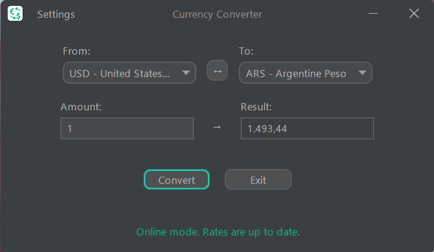
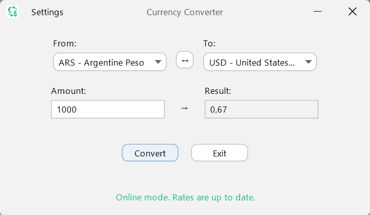
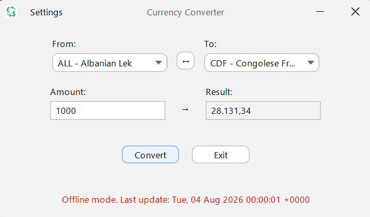

# Currency Converter 💱

A modern, robust desktop application built in Java that provides real-time currency exchange rates. Designed with a clean architecture, it features a modern graphical interface, seamless API integration, and a resilient offline mode.

## 🚀 Features

- **Real-Time Rates:** Fetches live exchange rates using the [ExchangeRate-API](https://www.exchangerate-api.com/).
- **Offline Mode (Cache Fallback):** Automatically saves the latest successful API response to a local JSON cache. If the internet connection fails, the app switches to offline mode and uses the cached data, displaying the timestamp of the last update.
- **Modern UI:** Powered by [FlatLaf](https://www.formdev.com/flatlaf/), featuring a clean design with smooth transitions.
- **Theme Engine:** Real-time toggle between Dark and Light modes directly from the settings menu.
- **Quick Swap:** Easily swap the source and target currencies with a single button click.
- **Input Validation:** Secure keystroke filtering and robust error handling to prevent application crashes on invalid inputs.

## 🛠️ Architecture & Tech Stack

This project was built following strict software engineering principles, separating the user interface, business logic, and API consumption.

- **Language:** Java (JDK 11+)
- **GUI Framework:** Java Swing
- **Build System:** Maven
- **Dependencies:** `com.google.code.gson` (for JSON parsing and serialization) and `com.formdev.flatlaf` (for the modern Look and Feel).
- **Design Patterns:** Service Layer Pattern, Cache Fallback.

## 📦 Installation & Usage

To run this project locally, you will need Java and Maven installed on your machine.

### 1. Clone the repository

```bash
git clone [https://github.com/Francisco-Gismondi/Currency-Converter.git](https://github.com/Francisco-Gismondi/Currency-Converter.git)
cd Currency-Converter
```

### 2. Configure the API Key

Create a ConfigReader utility (or update the existing one) to provide your own ExchangeRate-API key.

### 3. Run the Application

Since this project is in active development, the easiest way to run it is directly through your preferred Java IDE (such as Eclipse or IntelliJ IDEA). Simply import it as a Maven project, allow it to download the dependencies, and run your main class.

## 📸 Screenshots

**Dark Mode**


**Light Mode**


**Offline mode**

